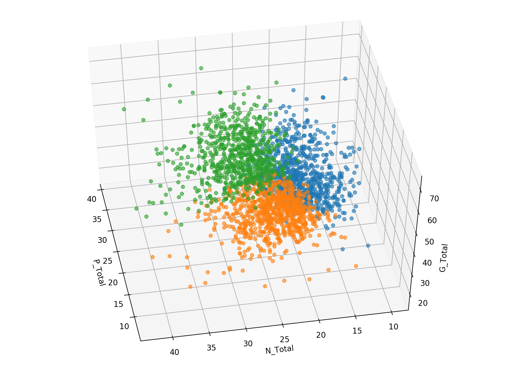

# Final Project of STATS202 @ Stanford University

>  STATS202: Data Mining and Analysis

## Data Analysis on PANSS Dataset

## Data

The Positive and Negative Syndrome Scale (**PANSS**) is a medical scale used for measuring symptom severity of patients with schizophrenia. Raw and cleaned datasets are located at `./data/`.

Please note that datasets `./data/Study_[A, B, C, D].csv` are labelled training sets, while `./data/Study_E.csv` is unlabelled testing sets.

## Tasks

The final project consisted of four tasks: testing for treatment effect, clustering patients, classifying assessment validity, and forecasting further PANSS scores. 

A more detailed description of the four tasks for this project (mentioned above) can be found in the instruction document at [`./final_project.pdf`](./final_project.pdf)

A 17-page report for this project was uploaded as well: [`./report/writeup.pdf`](./report/writeup.pdf)

## Methods and Dependencies

Most of this project was done using python while the hypothesis testing part used R;

K-Mean, PCA, and agglomerative clustering in clustering task were from `sklearn`;

Boosting, random forest, support vector regression, and support vector classification were from  `sklearn`;

Deep neural networks were from `tensorflow` .

## Directories

`./classification/`  Assessment validity classification (task 4).

`./cluster/`  Patient classification (task 2).

`./descriptive/`  Data visualization and treatment effect testing (task 1).

`./forecasting/`  Forecasting PANSS scores (task 3).

`./report/`  The writeup report for this final project.

`./util/`  Data manipulation utilities.

## Demonstrations

To verify the validity of k-mean clustering, the clustering results were visualized no a principal component space instead of the feature space. 

Run code below using bash to generate an interactive 3D plot.

```bash
cd ./clustering
python3.7 ./KMean_PCA.py --clusters=3 --components=3
```

Sample static plots (axes were adjusted for better illustration):




## References

References for what PANSS scores are and how they are measured can be found at `./references/`